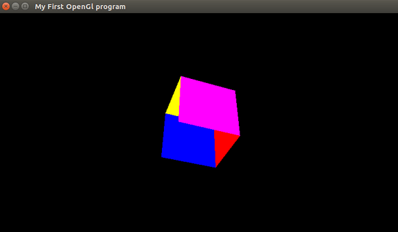

# OpenGL-Playground


### Terminal

```
g++ main.cpp Game.cpp -o test -lGLEW -lglut -lGL -lGLU

```





### NOTE

```
Above cube is made using Legacy openGL
```


### Further Reading

```
https://www.khronos.org/opengl/wiki/Load_OpenGL_Functions

```
